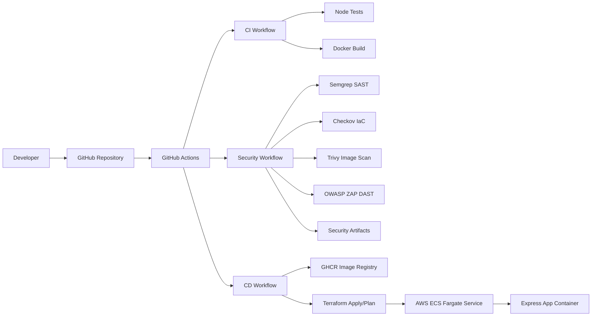
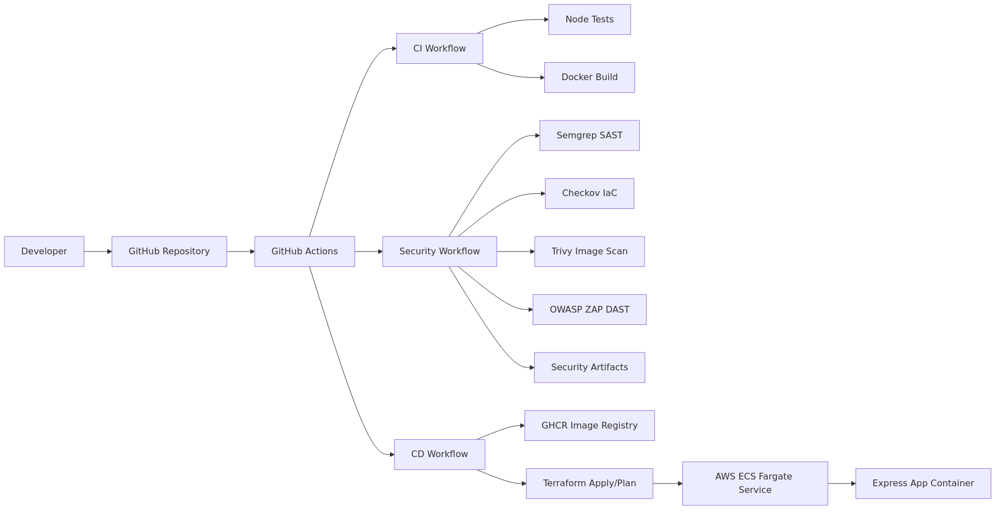
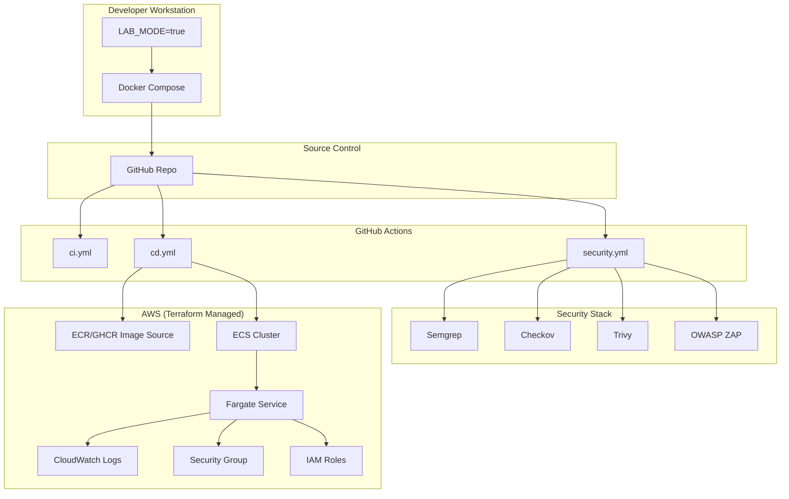
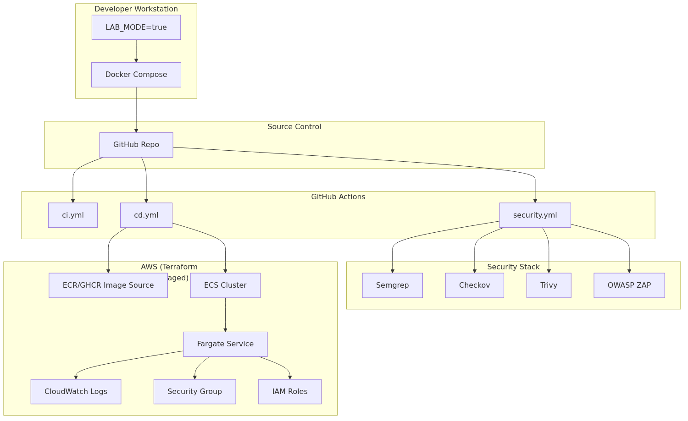

# DevSecOps Hybrid Security Lab + Production System

Portfolio-ready DevSecOps project using **Express.js**, Docker, Terraform on AWS ECS Fargate, and GitHub Actions with mandatory security gates.

## Project Overview

This repository demonstrates a hybrid model:

- **Production path**: CI + CD workflows and ECS Fargate deployment design
- **Security lab path**: controlled vulnerable behaviors enabled only in lab mode

The pipeline automatically scans:

- Application code (SAST with Semgrep)
- Infrastructure as Code (Checkov on Terraform)
- Container images (Trivy)
- Running web application behavior (OWASP ZAP baseline DAST)

By default, container runtime is production-safe. Vulnerabilities are exposed only when `LAB_MODE=true`.

## Project Structure

- `app/` - vulnerable Express.js application
- `infra/` - Terraform for AWS ECS Fargate infrastructure
- `Dockerfile` - Node 18 Alpine image build
- `docker-compose.yml` - local one-command run
- `.github/workflows/ci.yml` - test and build
- `.github/workflows/cd.yml` - image publish + optional Terraform plan/apply
- `.github/workflows/security.yml` - end-to-end security pipeline
- `README.md` - documentation

## Data Flow Diagram (DFD)



Static fallback image:  


**DFD Summary**
- Source: developer commits and pull requests
- Processing: CI/CD and security jobs in GitHub Actions
- Data stores: GHCR image registry and workflow artifacts
- Destination: running app on ECS Fargate (or local Docker lab mode)

## Architecture Diagram



Static fallback image:  


**Architecture Notes**
- `security.yml` enforces vulnerability gates before release progression.
- `cd.yml` handles image publication and Terraform-driven deployment steps.
- Lab and production concerns are separated through `LAB_MODE` and workflow staging.

## Tools Used

- **Semgrep** - SAST scanning for vulnerable code patterns
- **Checkov** - Terraform IaC security scanning
- **Trivy** - container vulnerability scanning
- **OWASP ZAP** - DAST baseline scan on live app endpoint

## Vulnerable Endpoints

- `GET /` - status endpoint
- `POST /login` - weak validation logic simulation
- `GET /admin` - intentionally no auth protection (only when `LAB_MODE=true`)
- `GET /exec?cmd=<value>` - simulated command injection (only when `LAB_MODE=true`)

## Run Locally (Single Command)

Prerequisite: Docker Desktop installed and running.

```bash
docker compose up --build
```

App URL: [http://localhost:3000](http://localhost:3000)

`docker-compose.yml` enables `LAB_MODE=true` so scanners can detect intentional issues.

## CI/CD Security Pipeline Behavior

Workflow files:

- `.github/workflows/ci.yml`
- `.github/workflows/security.yml`
- `.github/workflows/cd.yml`

Stages:
1. Checkout code
2. Install dependencies
3. Semgrep scan (fails on high/error)
4. Checkov scan on `infra/` (fails on critical)
5. Build Docker image
6. Trivy image scan (fails on HIGH/CRITICAL)
7. ZAP baseline scan using Docker (fails on HIGH/CRITICAL)
8. Print final summary + upload artifacts

## Pipeline Rules

- HIGH/CRITICAL vulnerabilities fail the workflow
- LOW/MEDIUM issues are allowed for demo learning
- Scan logs are visible in GitHub Actions
- Reports are uploaded as workflow artifacts

## Screenshot Placeholders

- `docs/screenshots/actions-security-run.png` - GitHub Actions pipeline run overview
- `docs/screenshots/semgrep-findings.png` - Semgrep report snippet
- `docs/screenshots/checkov-findings.png` - Checkov report snippet
- `docs/screenshots/trivy-findings.png` - Trivy report snippet
- `docs/screenshots/zap-findings.png` - ZAP baseline findings

## 5-Minute Demo Script (Interview Ready)

### 1) Start the lab environment

```bash
docker compose up --build -d
```

Expected result:
- Container starts on `http://localhost:3000`
- App runs with `LAB_MODE=true` for controlled vulnerability demonstrations

### 2) Verify app status

```bash
curl http://localhost:3000/
```

Expected result:
- JSON response with `status: "running"`
- Mode indicates lab behavior is enabled

### 3) Demonstrate vulnerable endpoints

```bash
curl http://localhost:3000/admin
curl "http://localhost:3000/exec?cmd=echo%20demo"
```

Expected result:
- `/admin` returns exposed admin-style data
- `/exec` executes unsafe command input (intentional lab vulnerability)

### 4) Push code and trigger pipeline

```bash
git add .
git commit -m "demo: run security pipeline"
git push origin main
```

Expected result in GitHub Actions:
- `ci.yml` runs tests/build
- `security.yml` runs Semgrep, Checkov, Trivy, and OWASP ZAP
- Pipeline fails if HIGH/CRITICAL findings breach policy gates

### 5) Show security evidence

In GitHub Actions:
- Open latest `security.yml` run
- Download `security-scan-artifacts`
- Highlight scanner outputs and policy-based pass/fail behavior

### 6) Close local lab

```bash
docker compose down
```

Expected result:
- Local demo environment is stopped and cleaned up

## Important Note

This project is intentionally vulnerable and built for learning only. Do not deploy it to production as-is.